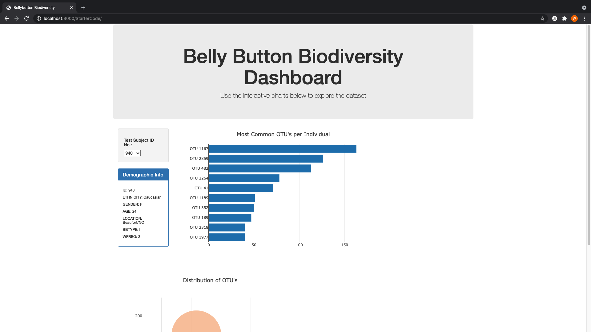
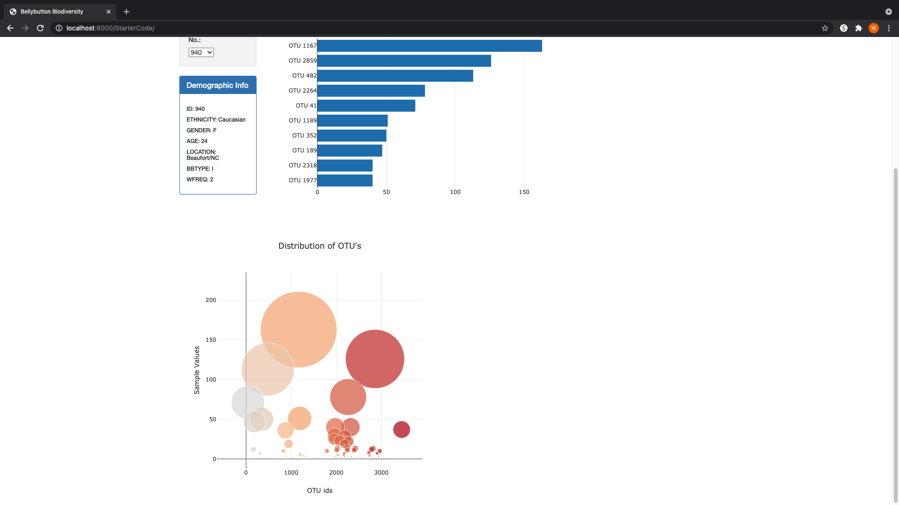

# Belly Button Biodiversity
The objective of this repository was to create a webapp that features an interactive dashboard to explore the Belly Button Biodiversity dataset, which cataglogs the microbes that colonize human navels. The dataset reveals that a small handful of microbial species (aka operational taxonomic units, or OTU's in the study) were present in the majority of subjects (more than 70%) while many of the others were pretty rare.

The dashboard enables user to view data by subject. On the upper left hand side of the screen is a dropdown menu where the user can select an i.d. number, which represents each subject in the study. Once an i.d. number is selected, the user can view a multitude of data on that subject. The data in that area will be in three areas. The first will be a panel that contains demographic information about the subject, such as ethnicity, gender, age, location, belly button type, and washing frequency. In addition to this demographic information, there will also be a horizontal bar chart present that will show the top ten most common OTU's found in that individual, and the quantity of each of the top ten most common OTU's found in that individual. In the bar chart, one can also hover over each bar to see the label for that OTU as well. Lastly there will be a bubble chart at the bottom that enables the user to visualize the distribution of the OTU's in that individual. An example of this dashboard can be viewed below.

Concerning the process for creating the dashboard, the d3 library was used to read the samples.json file. Following this, javascript was used to create the dropdown menu and to update the data when a different subject id was selected. To construct the plots, Plotly.js was used. 

In order to experience the interactive dashboard, click on this link:

